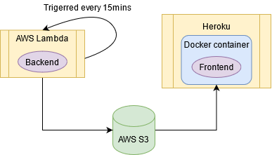

# Boulder gym tracker project

- [Boulder gym tracker project](#boulder-gym-tracker-project)
  - [Scraping](#scraping)
    - [Scrapy](#scrapy)
    - [Scrapinghub/Zyte](#scrapinghubzyte)
    - [AWS S3](#aws-s3)
  - [Front-end and deployment](#front-end-and-deployment)
    - [Streamlit](#streamlit)
    - [Heroku](#heroku)
  - [Resources](#resources)



## Scraping

Requirements

```bash
pip install scrapy
pip install scrapinghub
```

### [Scrapy](https://scrapy.org/)

* [Scrapinghub](https://www.scrapinghub.com/scrapy-cloud/): [documentation](https://doc.scrapinghub.com/scrapy-cloud.html)
* [PyOWM](https://github.com/csparpa/pyowm)
  * Set `OWM_API` in settings, either settings.py in local or Spider settings in Scrapinghub

```bash
# play around a website with scrapy
scrapy shell https://www.website.com
# run crawler locally and save item into `output.json`
scrapy crawl boulder -o output.json
# If an external storage is defined (S3 from AWS for example):
scrapy crawl boulder
```

### [Scrapinghub/Zyte](https://www.zyte.com/)

> Environment variables in Scrapinghub

1. Go to Spiders, click on your spider, raw settings and save your variable in this format
   1. `API = '123'`
2. Retrieve the environment variable in your code in this format
   1. `api = self.settings['API']`
   2. [How to access settings](https://doc.scrapy.org/en/latest/topics/settings.html)
3. Deploy the code, delete the periodic jobs, start it again

To deploy to [Scrapinghub](https://app.zyte.com/p/471449/jobs), the spider and app must be created beforehand:

```bash
shub deploy
```

### [AWS S3](https://aws.amazon.com/s3/)

Requirements

```bash
pip install awscli
pip install boto3
```

Set the environment variables `AWS_ACCESS_KEY_ID`, `AWS_SECRET_ACCESS_KEY`, `FEED_URI = 's3://your-bucket/%(time)s.csv'` in Scrapinghub settings as stated in the [documentation](https://doc.scrapy.org/en/latest/topics/feed-exports.html#s3)

To download items from AWS bucket, first, configure your credentials

```bash
aws configure
```

Enter the security credentials created in [AWS console](https://console.aws.amazon.com), click on your username at the top right, `My security credentials`, `Create new access key`. Enter your region as well. For me it's `eu-central-1`. Once this is done, to download to a specific folder, where `bboulder` is the bucket name in your AWS S3 account.

```bash
mkdir awsdata
cd awsdata
aws s3 sync s3://bboulder .
```

Or run `python src/data_from_cloud.py`, which downloads the objects from S3 and merges them with the existing .csv.

## Front-end and deployment

Requirements

```bash
pip install streamlit
pip install heroku
```

### [Streamlit](https://streamlit.io/)

Run streamlit locally

```bash
streamlit run app.py
```

Streamlit supports [Streamlit Sharing](https://www.streamlit.io/sharing), an easy way to deploy Streamlit apps. But as of now they have a storage limitation, which is why this app has been deployed in Heroku.

### [Heroku](https://devcenter.heroku.com/)

* [Create app in Heroku](https://dashboard.heroku.com) and set a name
* Create Dockerfile
  * Add specific streamlit commands, echo `$PORT` ([important](https://discuss.streamlit.io/t/deploying-heroku-error/1310/3)! The app might not recognize the port otherwise)
  * **Install dependencies before copying files**: see [Layer caching in this Medium post](https://blog.realkinetic.com/building-minimal-docker-containers-for-python-applications-37d0272c52f3)
  * When connecting to heroku, use `container:`

```bash
# attach project to heroku app
heroku git:remote -a bouldergym
# log in with the CLI
heroku container:login
# push changes to heroku
heroku container:push web
# release app
heroku container:release web
# to scale it down=shut it off, web=0. To scale it back up, web=1
heroku ps:scale web=0
# to check logs
heroku logs --tail
```

---------

## Resources

Legal info about scraping/crawling

1. [Web Scraping and Crawling Are Perfectly Legal, Right?](https://benbernardblog.com/web-scraping-and-crawling-are-perfectly-legal-right/)
2. [robots.txt file](https://www.boulderwelt-muenchen-ost.de/robots.txt) doesn't disallow scraping the main webpage.
3. No prohibitions in AGB or Datenschutzerklärung. No Nutzunsbedingungen

Estimation of circa 300 people for 59% of whole capacity (corona capacity).
