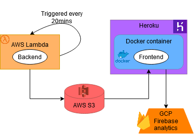

# Boulder gym tracker project



## Backend docker

Set AWS profile
```
export AWS_PROFILE=boulder
```

Or set the environment variables `AWS_ACCESS_KEY_ID`, `AWS_SECRET_ACCESS_KEY`, `OWM_API`.

To run backend Dockerfile in local:

```bash
docker build -t boulder-backend -f Dockerfile.backend .
docker run -d boulder-backend
# check container name with docker ps
docker exec -it CONTAINER_NAME /bin/bash
```

## Front-end

Run [Streamlit](https://streamlit.io/) locally:

```bash
streamlit run app.py
```

## Deployment: [Heroku](https://devcenter.heroku.com/)

1. Create app in Heroku and set a name. In this case, **`bouldern`**.
2. Create `Dockerfile.web` with [specific streamlit commands](https://discuss.streamlit.io/t/how-to-use-streamlit-in-docker/1067/2)
3. Create `Dockerfile.backend` with the backend clock function in CMD
4. Set web and backend in `heroku.yml`
5. Create environment variables in Heroku: `AWS_ACCESS_KEY_ID`, `AWS_SECRET_ACCESS_KEY`, `OWM_API` from [PyOWM](https://github.com/csparpa/pyowm)

Log in to Heroku from the terminal

```bash
# attach project to heroku app
heroku git:remote -a bouldern
# log in with the CLI. docker must be running
heroku container:login
```

Push and release project in Heroku

```bash
# push changes to heroku, --recursive so that it takes web & backend
heroku container:push --recursive
# release app
heroku container:release web backend
# upscale backend, it's off by default
heroku ps:scale backend=1
# check logs
heroku logs --tail
```

Alternatively, as the way it's set up now, you can connect Heroku to Github so that the commits to the main branch trigger a Heroku deployment.

---------

## Resources

Legal info about scraping/crawling

1. [Web Scraping and Crawling Are Perfectly Legal, Right?](https://benbernardblog.com/web-scraping-and-crawling-are-perfectly-legal-right/)
2. [robots.txt file](https://www.boulderwelt-muenchen-ost.de/robots.txt) doesn't prohibit scraping the main webpage
3. No prohibitions in AGB or Datenschutzerklärung. No Nutzunsbedingungen

Estimation of circa 300 people for 59% of whole capacity (corona capacity).
